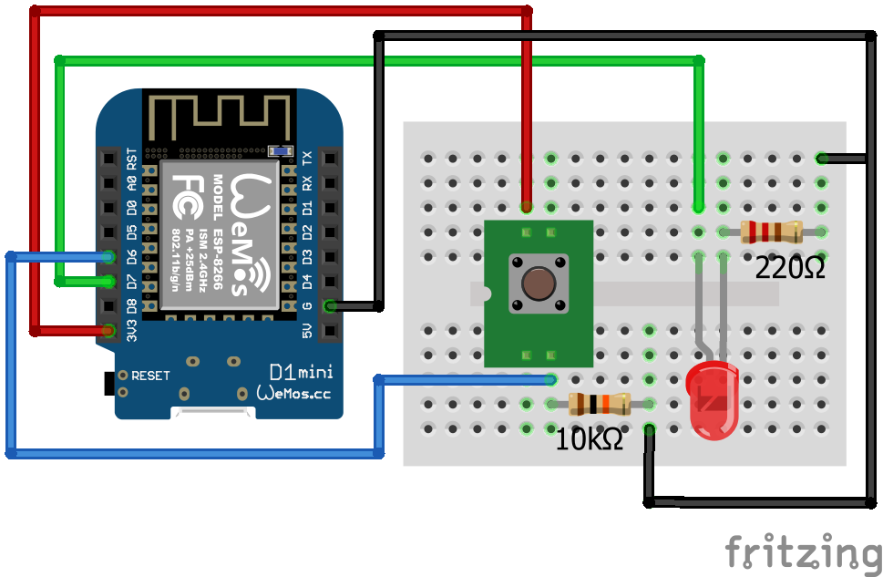

## Проект «Управление светодиодом по нажатию кнопки»

В этом проекте мы познакомимся с двумя основами взаимодействия пинов — чтение и запись цифрового сигнала

  **Нам понадобится:**

-   Светодиод    
-   Резистор 220 Ом    
-   Резистор 10к Ом    
-   Кнопка    
-   Макетная плата    
-   Провода    
-   Микроконтроллер Wemos D1 R2 или Wemos D1 mini
    

Светодиод необходимо подключать через резистор, т.к без него от большого тока он сгорит.

Например пин выдает 5в, резистор — 200 Ом. По Закону Ома U = I*R, ток будет 5в / 220ом = 0.02 Ампера, что достаточно для питания светодиода.

  

Кнопку необходимо подключать вместе с резистором -
не подключенный никуда цифровой пин принимает наводки из воздуха, и считанное с него значение будет практически случайным. Для решения этой проблемы существует такое понятие, как подтяжка (pull) пина. Подтяжка выполняется к земле (pull down) или питанию (pull up) микроконтроллера при помощи резистора.  
  
   

**Схема**

**Код**

[button_led.ino](button_led.ino)
