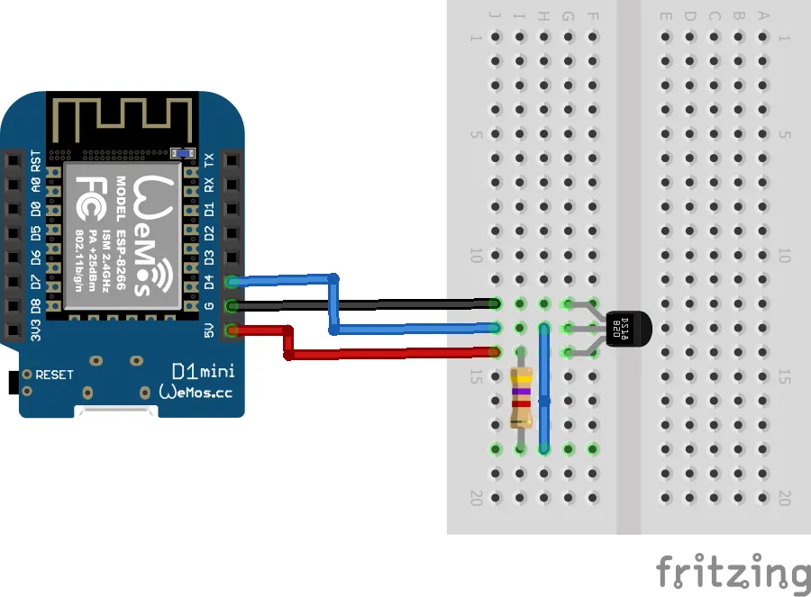

## Проект «Измерение температуры»

В этом проекте мы научимся работать с цифровым датчиком температуры DS18B20.

**Нам понадобится:**
-   Датчик температуры DS18B20    
-   Макетная плата    
-   Провода    
-   Резистор 4.7 кОм    
-   Микроконтроллер Wemos D1 R2 или Wemos D1 mini

   

**Схема**

**Код**

[ds18b20.ino](ds18b20.ino)