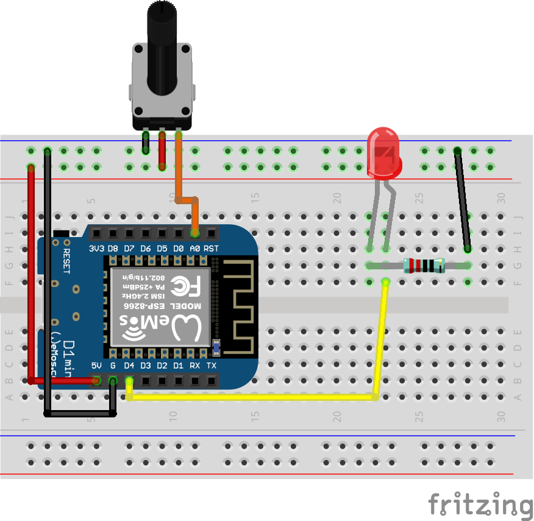

## Проект «Управление яркостью светодиода»

  
В этом проекте мы научимся работать с ШИМ — управлять яркостью светодиода, считывать значение потенциометра с аналогового входа

**Нам понадобится:**

-   Светодиод    
-   Модуль потенциометра    
-   Резистор 220 Ом    
-   Макетная плата    
-   Провода    
-   Микроконтроллер Wemos D1 R2 или Wemos D1 mini

   

**Схема**

**Код**

[pwm_led.ino](pwm_led.ino)
