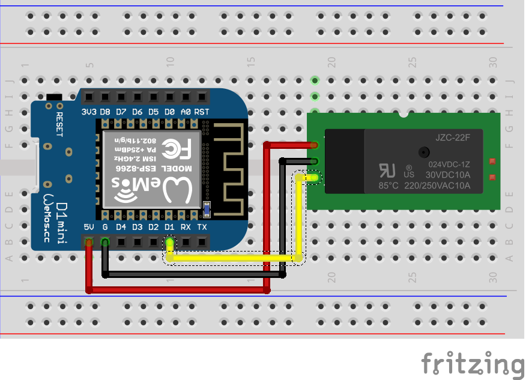

## Проект «Управление реле по точному времени»

В этом проекте мы научимся получать время с сервера точного времени, переключать(замыкать) реле в заданный интервал времени.
  

**Нам понадобится:**
-   Модуль реле    
-   Макетная плата    
-   Провода    
-   Микроконтроллер Wemos D1 R2 или Wemos D1 mini    
-   Wifi сеть

   

**Схема**

**Код**

[relay_ntp.ino](relay_ntp.ino)
