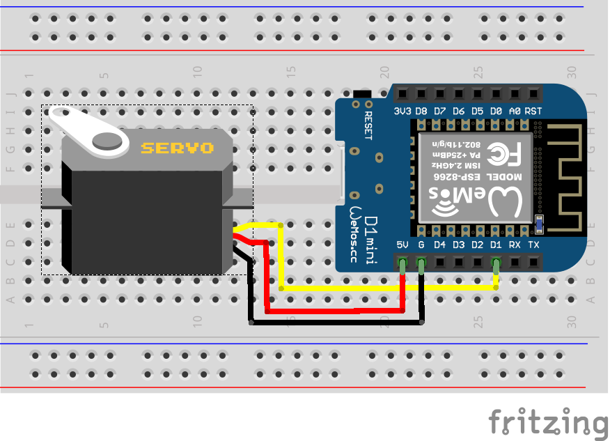

## Проект «Подключение сервомотора»

В этом проекте мы научимся работать с сервомотором. Sg90 обладает углом поворота 180 градусов

**Нам понадобится:**
-   Сервомотор sg90 
-   Провода     
-   Микроконтроллер Wemos D1 R2 или Wemos D1 mini
   

**Схема**

**Код**

[ds18b20.ino](sg90.ino)