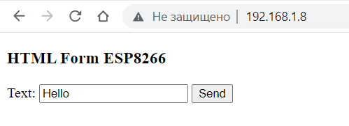
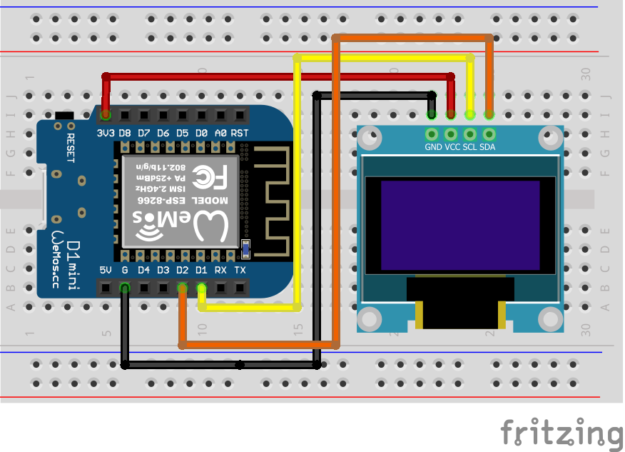

## Проект «Управление дисплеем из веб-браузера»

В этом проекте мы научимся подключаться к wifi сети, запустим мини-сайт на микроконтроллере, позволяющий отправлять сообщение на дисплей. 
  

**Нам понадобится:**
-   OLED дисплей ssd1306    
-   Макетная плата    
-   Провода    
-   Микроконтроллер Wemos D1 R2 или Wemos D1 mini    
-   Wifi сеть
   

**Схема**

**Код**

[ssd1306_webserver.ino](ssd1306_webserver.ino)
