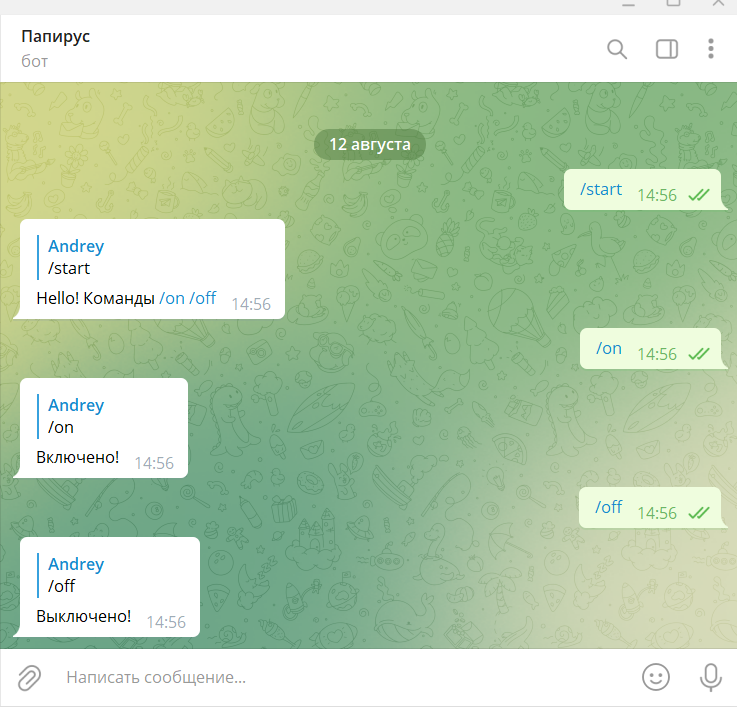
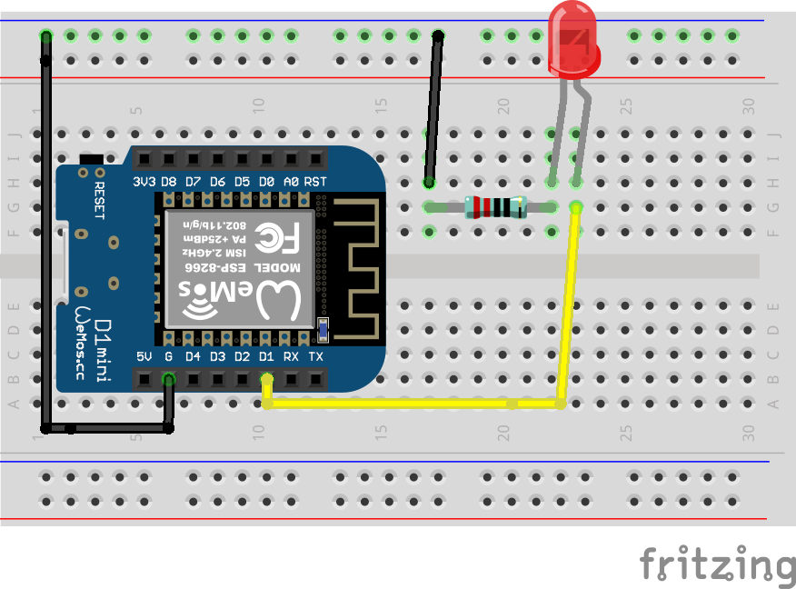

## Проект «Управление через телеграм»

В этом проекте мы создадим телеграм бота и свяжем его с нашим микроконтроллером для управления светодиодом из любой точки мира. 
Управлять свветодиодом будем отправляя простые команды /on, /off

**Нам понадобится:**
-   Светодиод 
-   Провода     
-   Макетная плата
-   Микроконтроллер Wemos D1 R2 или Wemos D1 mini
-   Домашняя WI-FI сеть с выходом в интернет
-   Телеграм-бот
   

Чтобы создать телеграм бота, достаточно написать в телеграм специальному боту @BotFather и следовать его инструкциям. В конце создания бота, вам дадут специальный API_TOKEN, который необходимо будет прописать в программе - именно он свяжет микроконтроллер с вашим ботом.

**Схема**

**Код**

[telegram_simple.ino](telegram_simple.ino)